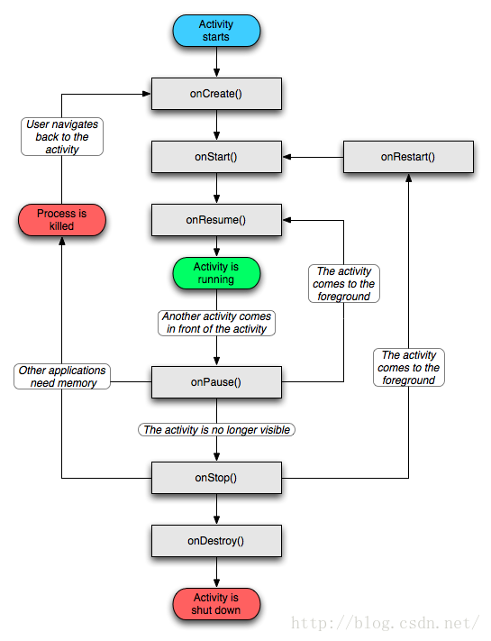

<!-- TOC depthFrom:1 depthTo:6 withLinks:1 updateOnSave:1 orderedList:0 -->

- [概述](#概述)
- [Activity 生命周期](#activity-生命周期)

<!-- /TOC -->
# 概述
在日常应用中**Activity是与用户交互的接口**，它提供了一个用户完成相关操作的窗口。当我们在开发中创建Activity后，通过调用setContentView(View)方法来给该Activity指定一个布局界面，而这个界面就是提供给用户交互的接口。Android系统中是通过Activity栈的方式来管理Activity的，而Activity自身则是通过生命周期的方法来管理的自己的创建与销毁。

# Activity 生命周期

- **onCreate**: 在Activity被创建时回调，它是**生命周期第一个调用的方法**，我们在创建Activity时一般都需要重写该方法，然后在该方法中做一些初始化的操作
- **onStart**：表示Activity正在启动，此时**Activity已处于可见状态**，只是还没有在前台显示，因此无法与用户进行交互
- **onResume**：Activity已在前台可见，**可与用户进行交互**
- **onPause**：**Activity正在停止**，一般情况下onStop方法会紧接着被回调。但通过流程图我们还可以看到一种情况是onPause方法执行后直接执行了onResume方法，这属于比较极端的现象了，这可能是用户操作使当前Activity退居后台后又迅速地再回到到当前的Activity，此时onResume方法就会被回调。当然，在onPause方法中我们可以做一些数据存储或者动画停止或者资源回收的操作，但是不能太耗时，因为这可能会影响到新的Activity的显示——onPause方法执行完成后，新Activity的onResume方法才会被执行
- **onStop**：一般在**onPause方法执行完成直接执行**，表示Activity即将停止或者完全被覆盖（Stopped形态），此时**Activity不可见，仅在后台运行**
- **onRestart**：**Activity正在重新启动**，当Activity由不可见变为可见状态时，该方法被回调。这种情况一般是用户打开了一个新的Activity时，当前的Activity就会被暂停（onPause和onStop被执行了），接着又回到当前Activity页面时，onRestart方法就会被回调
- **onDestory**：Activity正在被销毁，也是**生命周期最后一个执行的方法**，一般我们可以在此方法中做一些回收工作和最终的资源释放
