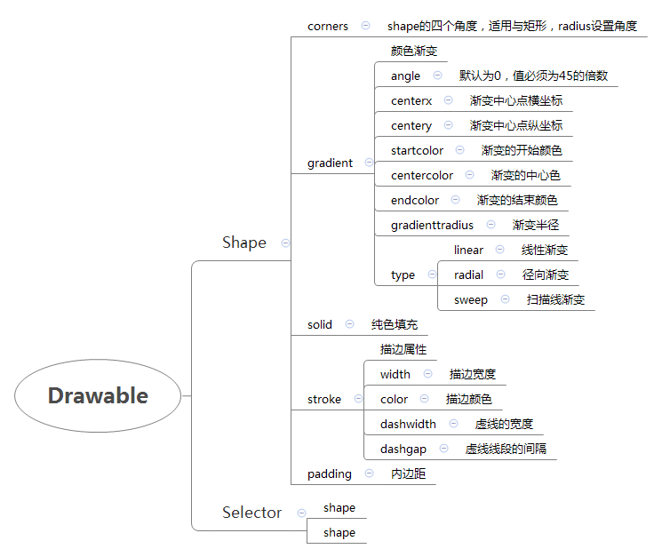

# 概述
想要自定义样式，在drawable里建'Drawable resource file'文件

# 图解


# 样例代码
```javascript
<?xml version="1.0" encoding="utf-8"?>
<shape xmlns:android="http://schemas.android.com/apk/res/android">
    <corners android:radius="15dp"></corners>
    <solid android:color="@color/text_blue"></solid>
</shape>
```
```javascript
<?xml version="1.0" encoding="utf-8"?>
<selector xmlns:android="http://schemas.android.com/apk/res/android">

    <item android:state_selected="true">
        <shape>
            <solid android:color="#FFC4C4C4"/>
        </shape>
    </item>
    <item>
        <shape>
            <solid android:color="@color/transparent" />
        </shape>
    </item>

</selector>
```
